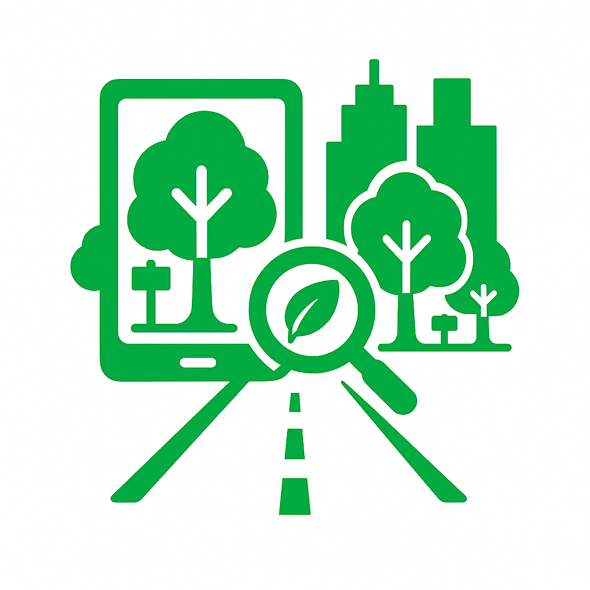

# 🌳 Street Tree Detection and Counting in Taipei City

This project focuses on detecting individual street trees in Taipei City using high-resolution satellite imagery and deep learning.

---

## 📌 Project Objective

- Automatically locate individual **street trees** from RGB satellite images.
- Automatically count the number of **street trees** from RGB satellite images.
- Focused on **urban settings**, where trees are often occluded or surrounded by buildings.
- Especially designed for **Taipei City**, Taiwan.
---

## 🧠 Methodology

Main Model:
**YOLO 11** 

Technical Details:

---

## 🗂️ Dataset Sources
Pre-processed datasets are available in [here](https://huggingface.co/datasets/zbyzby/TaipeiTrees/tree/main).

| Source | Description |
|--------|-------------|
| [Taipei City Government Open Data](https://data.gov.tw/) | Tree location in Taipei for finetuning |
| [Google Maps Static API](https://developers.google.com/maps/documentation/maps-static/overview?hl=en) | Satellite RGB imagery in Taipei for finetuning |
| [Forest Damages – Larch Casebearer](https://lila.science/datasets/forest-damages-larch-casebearer/) | Pretraining on tree detection |
| [IDTReeS](https://zenodo.org/records/3934932) | Pretraining on tree detection |

---
## 📦 Result

